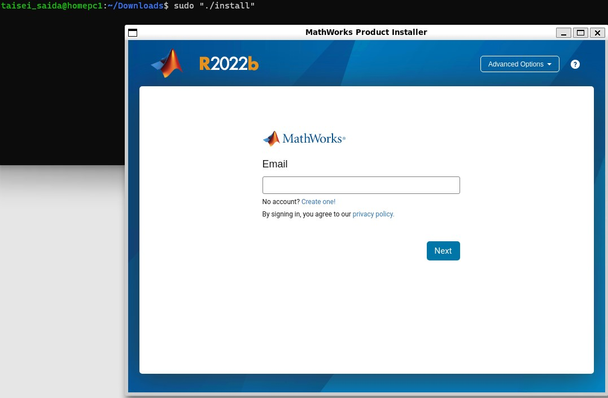
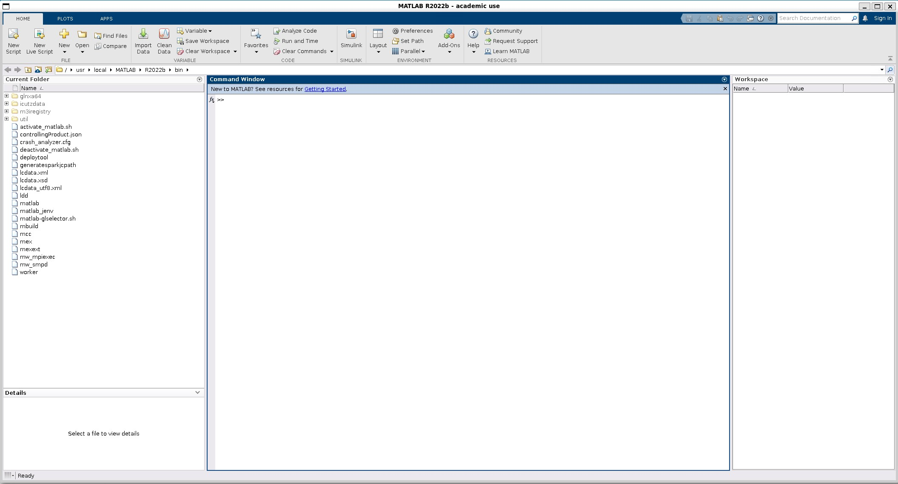

How to install matlab on wsl2. 

I will show you the steps to install matlab on wsl2 and some tips to avoid common problems.

Before we start, make sure you have wsl2 enabled on your Windows 10 system. You can check this by typing `wsl --list --verbose` in the command prompt. You should see something like this:
```
  NAME            STATE           VERSION
* Ubuntu-20.04    Running         2
```

If you don't have wsl2 enabled, you can follow the instructions on [this page](https://docs.microsoft.com/en-us/windows/wsl/install-win10) to install it.

Also, make sure you have a graphical user interface (GUI) for wsl2. You can use any X server software for Windows. You can test if the GUI is working by typing `xeyes` in wsl2. You should see a pair of eyes following your mouse cursor on the screen. If you have recently installed wsl2, you should be in this state from the beginning.


Now, let's proceed to the matlab installation. First, download the matlab installer for Linux from the [matlab website](https://www.mathworks.com/downloads/). You will need to log in with your matlab account and select the version and platform you want. In this case, we will use matlab R2022b for Linux 64-bit. The file name should be something like matlab_R2022b_glnxa64.zip.

You cannot use wget or curl to download the file, as you will need to accept the license agreement on the website. So, download the file directly from the website and save it to your Downloads folder in wsl2.


You may be tempted to start the installation right away, but there is one thing you need to do first. If you reboot wsl2, the mac address of the network interface will change, and this will cause problems with the matlab license activation. To avoid this, you need to fix the mac address of wsl2.

To fix the mac address, add the following script to your ~/.bashrc file in wsl2. Replace (your mac address) with the mac address you want to use. You can find your current mac address by typing `ip link show` in wsl2. The script is based on [this issue](https://github.com/microsoft/WSL/issues/5352#:~:text=Mar%2016%2C%202022-,For%20software,-that%20only%20checks) on GitHub.
```sh
mac=(your mac address)
gateway=$(ip route | awk '/default via /{print $3; exit}' 2>/dev/null)
if ! ip link show | grep -q $mac; then
    sudo ip link set dev eth0 down
    sudo ip link set dev eth0 up
    sudo ip route add default via $gateway dev eth0
    sudo ip link set dev bond0 down
    sudo ip link set dev bond0 address $mac
    sudo ip link set dev bond0 up
fi
```

</br></br>
After adding the script, restart wsl2 by typing `wsl --shutdown` in the command prompt and then launching it again.

Now, you are ready to install matlab. Go to the Downloads folder in wsl2 and unzip the matlab installer file.
```sh
cd ~/Downloads
unzip matlab_R2022b_glnxa64.zip
```
</br></br>
Then you will find the installer, run it.
```sh
sudo ". /install"
```
</br></br>
The installer will launch and show you a graphical interface. Follow the instructions on the screen to complete the installation. You will need to log in with your matlab account, accept the license agreement, choose the installation folder and the products you want to install, and activate the license.


Finally, set the path so that you can start matlab with the `matlab` command. Add the following line to the end of ~/.bashrc.
```sh
export PATH="$PATH:/usr/local/MATLAB/R2022b/bin"
```

If you type `matlab` as a test, you will see the screen below and verify that it can be launched.


Congratulations, you have successfully installed matlab on wsl2. You can now use matlab as you would on a Linux system.

I hope this blog post was helpful for you to install matlab on wsl2. Thank you for reading.